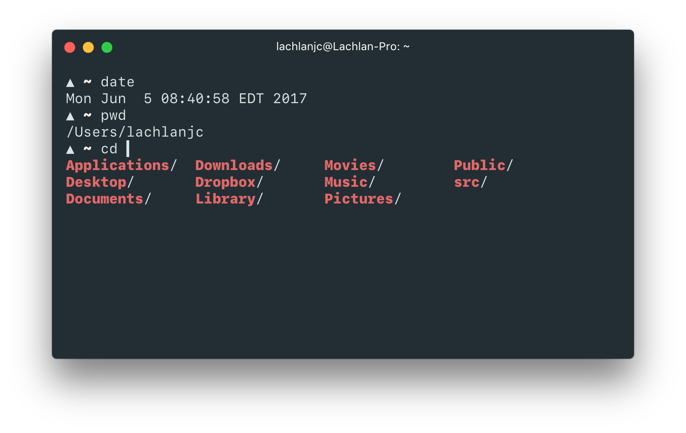

# Hyperpaste

[Toothpaste](https://github.com/imcatnoone/toothpaste) for your [Hyper](https://hyper.is) (theme).

Add `hyperpaste` to your `plugins` in `~/.hyper.js`.

MIT license

---
*Another thing by [@lachlanjc](https://lachlanjc.me).*
